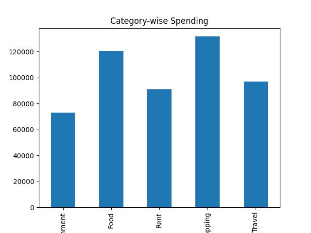
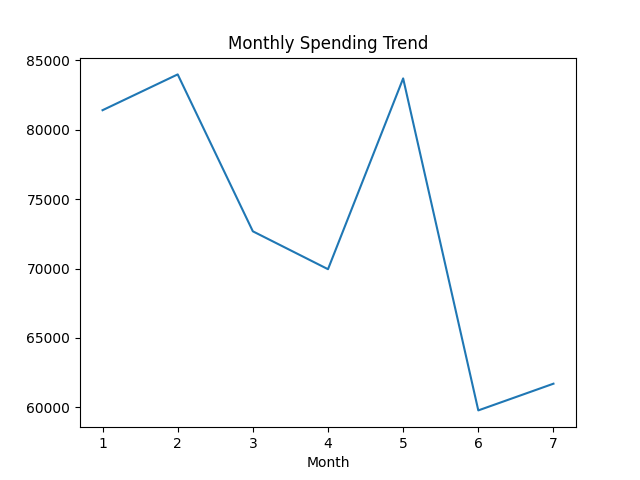
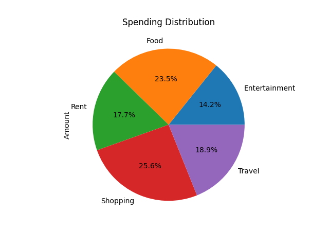
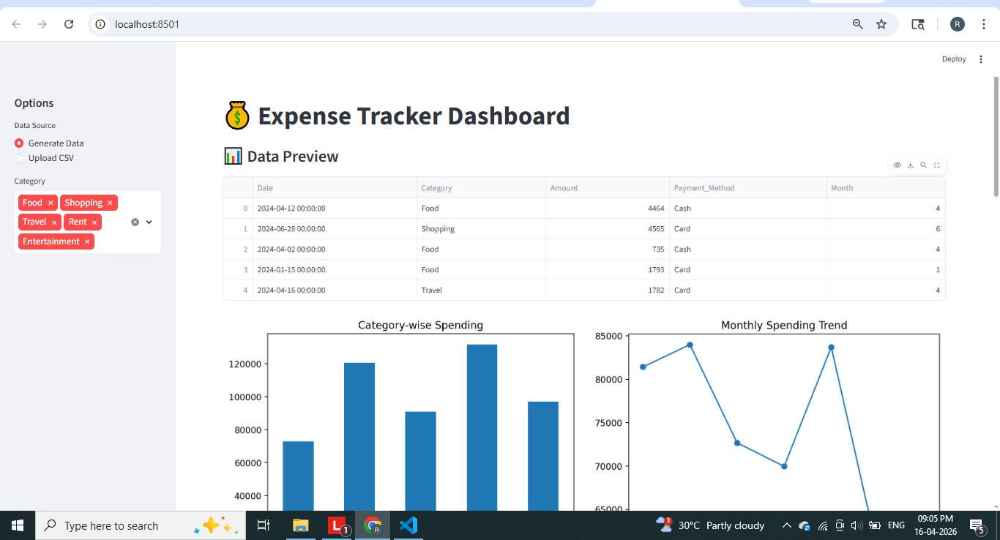
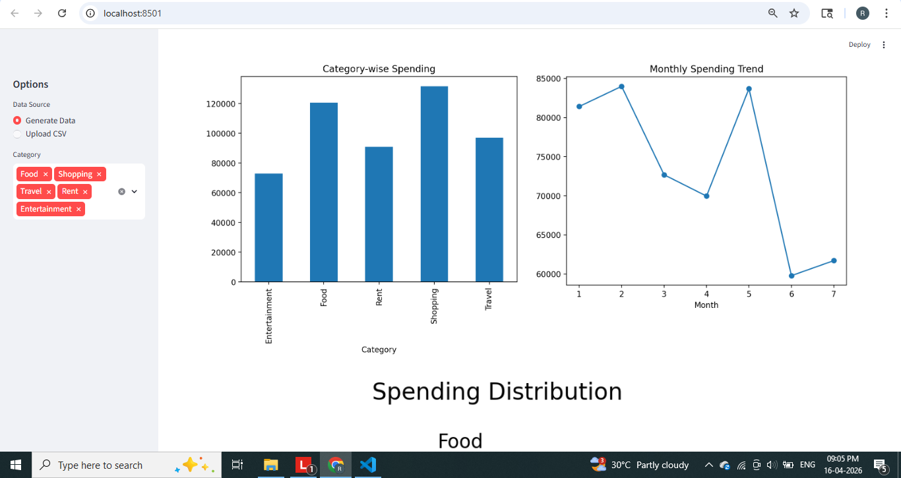
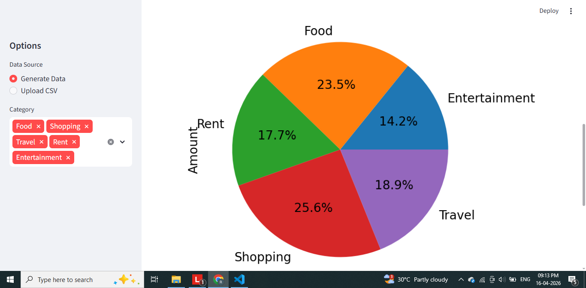
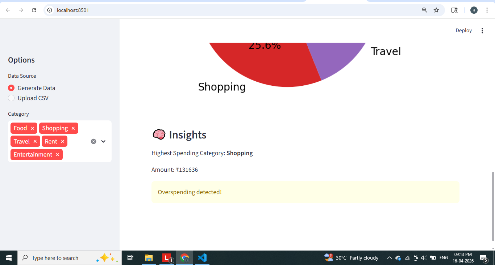

# 💰 Expense Tracker App using Data Science

## 📌 Overview

The **Expense Tracker App** is a data-driven application that helps users track, analyze, and visualize their spending patterns.
It is designed using **Python, Data Science techniques, and Streamlit** to provide actionable financial insights.

---

## ❗ Problem Statement

Managing personal or business expenses manually is difficult and often leads to:

* Overspending
* Lack of budgeting
* Poor financial planning

---

## 💡 Solution

This project provides:

* Automated expense tracking
* Data analysis of spending habits
* Visual dashboards for insights
* Overspending detection

---

## 🚀 Features

* 📊 Synthetic data generation (no real dataset required)
* 🧹 Data cleaning & preprocessing
* 📈 Category-wise and monthly analysis
* 📉 Visualizations (Bar, Line, Pie charts)
* 🎯 Insights generation (highest spending category)
* 📂 CSV upload support
* 🎛️ Interactive Streamlit dashboard
* ⬇️ Download filtered data

---

## 🛠️ Tech Stack

* **Programming:** Python
* **Libraries:** Pandas, NumPy
* **Visualization:** Matplotlib
* **Dashboard:** Streamlit

---

## 🏗️ Project Structure

```
Expense-Tracker-App/
│
├── data/
│   └── expenses.csv
│
├── src/
│   ├── data_generator.py
│   ├── preprocessing.py
│   ├── analysis.py
│   └── visualization.py
│
├── streamlit_app.py
├── main.py
├── requirements.txt
└── README.md
```

---

## ⚙️ Installation

### 1. Clone Repository

```
git clone https://github.com/your-username/Expense-Tracker-Data-Science.git
cd Expense-Tracker-Data-Science
```

### 2. Create Virtual Environment

```
python -m venv expense_env
```

Activate:

**Windows**

```
expense_env\Scripts\activate
```

**Mac/Linux**

```
source expense_env/bin/activate
```

### 3. Install Requirements

```
pip install -r requirements.txt
```

---

## ▶️ Run the Application

```
streamlit run streamlit_app.py
```

---

## 📊 Outputs

### 📌 Dashboard Features

* Data Preview
* Category-wise Spending
* Monthly Trend Analysis
* Spending Distribution (Pie Chart)
* Insights Section

---

## 📸 Screenshots








```

---

## 🧠 Key Insights

* Identifies highest spending category
* Detects overspending patterns
* Helps in financial decision-making

---

## 📈 Use Cases

* Personal finance tracking
* Budget management
* Business expense monitoring
* Financial analysis

---

## 🔮 Future Improvements

* 💡 Budget alerts
* 🤖 AI-based expense prediction
* 📱 Mobile app integration
* ☁️ Cloud database storage

---

## 🎯 Learning Outcomes

* Data analysis using Pandas
* Data visualization techniques
* Building dashboards using Streamlit
* Writing modular and scalable code
* Real-world project structuring

---

## 🤝 Contributing

Feel free to fork this repository and improve it!

---

## 📬 Contact

Created by **[Rakshitha A S]**
For queries or collaboration, feel free to connect.

---

⭐ If you like this project, give it a star!
